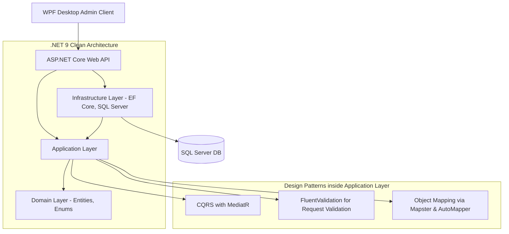

# BrokerShield 360 (Insurance Broker System)

An enterprise-grade **Insurance Broker Management System** built with **.NET 9** (`net9.0-windows`) following **Clean Architecture** principles, employing **CQRS with MediatR**, and providing a modern **WPF Administrative Client** using dynamic navigation.

---

## 🏗️ Architectural & Design Patterns

This system is built using modern software engineering patterns to ensure high testability, maintainability, and clean separation of concerns:

### 1. Clean Architecture (Onion Architecture)
The codebase is divided into distinct layers with clear dependency directions:
- **`InsuranceBrokerSystem.Domain`**: Core enterprise entities, enums, value objects, and specifications (Zero dependencies).
- **`InsuranceBrokerSystem.Application`**: Use cases, MediatR commands/queries, mapping profiles, and custom interfaces.
- **`InsuranceBrokerSystem.Infrastructure`**: DB context (EF Core), repository implementations, database initialization (seeding), and security hashing.
- **`InsuranceBrokerSystem.Api`**: REST controller endpoints, authentication configuration, middlewares, and startup bootstrap.
- **`InsuranceBrokerSystem.UI`**: A WPF client application loading views dynamically inside a centralized shell.



### 2. CQRS Pattern via MediatR
Commands (actions that modify state) and Queries (actions that fetch data) are completely separated inside the `Application` layer. Features are grouped modularly, exposing request handlers using `MediatR`.

### 3. Request Validation
Robust input validation is achieved using **FluentValidation**, ensuring that HTTP requests and application command payloads are validated prior to executing business logic.

### 4. Dependency Injection & Service Scanning
Utilizes **Scrutor** to automatically scan assemblies and register services dynamically, reducing boilerplate dependency injection configuration.

---

## ✨ System Features & Modules

### 👥 Client Registry
- Complete client lifecycle management (Create, Read, Update, Delete, Block, Approve, Reject).
- Nested records for client bank accounts, documents, and contact details.

### 💼 Financial Module & Chart of Accounts
- Ledger account management and financial configurations.
- Automatic account generation and approval flow for insurance companies.

### 🏛️ Master Data Configuration (Registry)
Unified administration of reference tables including:
- **Banks & Positions**
- **Insurance Classes & Lines of Business**
- **Insurance Companies & Products**
- **Nationalities & Locations**
- **Policy Types & Sources of Income**

---

## 🛠️ Technology Stack & Libraries

| Component | Technology / Library | Usage |
| :--- | :--- | :--- |
| **Framework Target** | .NET 9.0 | Target framework for API, Application, and WPF UI |
| **Database Provider** | EF Core + SQL Server | Data persistence, Migrations, Repositories |
| **Command/Query Dispatcher** | MediatR | CQRS implementation |
| **Validation Engine** | FluentValidation | Decoupled request and model validation |
| **Assembly Scanning** | Scrutor | Automatic dependency injection |
| **Object-to-Object Mapper** | Mapster & AutoMapper | Entity-to-DTO and Request-to-Command mapping |
| **Cryptography** | BCrypt.Net-Next | Secure password hashing |
| **Authentication** | JwtBearer Authentication | JWT-token based API endpoint protection |
| **API Documentation** | Swashbuckle (Swagger) | RESTful API playground and schema documentation |
| **Desktop Client UI** | WPF / XAML | Administrative desktop interface |

---

## 📁 Solution Structure

```text
InsuranceBrokerSystem/
│
├── InsuranceBrokerSystem.sln            # .NET Solution File
│
├── InsuranceBrokerSystem.Api/           # Controllers (Auth, Clients, Financial, Master Table)
├── InsuranceBrokerSystem.Application/   # Features (CQRS Commands/Queries), Validation, DTOs
├── InsuranceBrokerSystem.Domain/        # Core Domain Entities (Client, Bank, User, Position, etc.)
├── InsuranceBrokerSystem.Infrastructure/# AppDbContext, Repositories, Migrations, DbInitializer
│
└── InsuranceBrokerSystem.UI/            # WPF UI Views (Dashboard, Financial, Clients, MasterData)
```

---

## 🚀 Getting Started

### Prerequisites
- **.NET SDK 9.0**
- **SQL Server** (LocalDB, Express, or Developer edition)
- **Visual Studio 2022** (with WPF and C# workloads)

---

### 1. Database Setup
Configure the connection string inside `InsuranceBrokerSystem.Api/appsettings.json`:

```json
"ConnectionStrings": {
  "DbConnection": "Server=.;Database=IBS_DB;Trusted_Connection=True;TrustServerCertificate=True;MultiSubnetFailover=True;"
}
```

Apply migrations to initialize `IBS_DB` database:
```bash
# Run from the repository root
dotnet ef database update --project InsuranceBrokerSystem.Infrastructure --startup-project InsuranceBrokerSystem.Api
```

*Note: On startup, the database context automatically seeds default roles and the initial administrative user.*

---

### 2. Running the Backend API
```bash
cd InsuranceBrokerSystem.Api
dotnet run
```
Available endpoints:
- **IIS Express** (Used by WPF App): `https://localhost:44314`
- **Kestrel Profile**: `https://localhost:7039`

Swagger playground is accessible at `https://localhost:7039/swagger/index.html`.

---

### 3. Launching the WPF Administrative Interface
1. Open the solution in **Visual Studio 2022**.
2. Configure **Multiple Startup Projects**:
   - `InsuranceBrokerSystem.Api` -> **Start**
   - `InsuranceBrokerSystem.UI` -> **Start**
3. Press `F5` to build and run.

---
